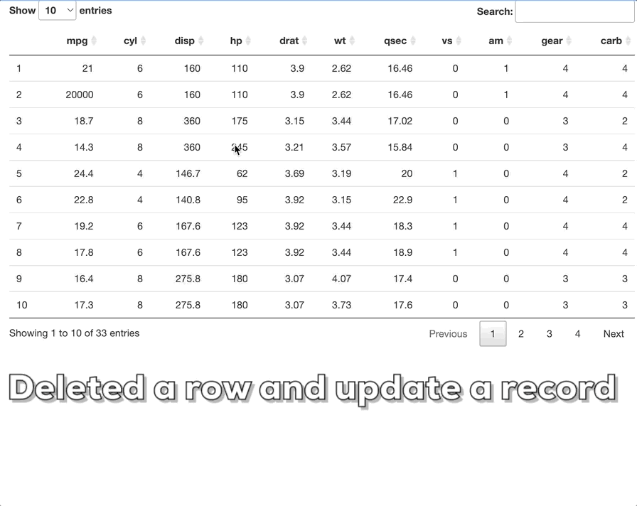

# shiny_edit

Shiny app with editing functionality. There are a lot of scenarios in Shiny apps that could use an easy to implement functionality for users to input data. This project aims to shorten that process for everyone by sharing reusable process that allows other folks to customize. 

Currently, we have examples that works with [DT](https://rstudio.github.io/DT/) table and [reactable](https://glin.github.io/reactable/) as both of them have a lot of flexibility for users to achieve different features. If we only need to implement the insert functionality, we should be able to choose any tables that works with Shiny. 

## Features

+ Quickly generate different input UI in a modal dialog based on initial example.
+ Able to insert and copy, update, delete by clicking a specific row.
+ Functionality to save the existing dataset after applying updates.  

## Example Uses

